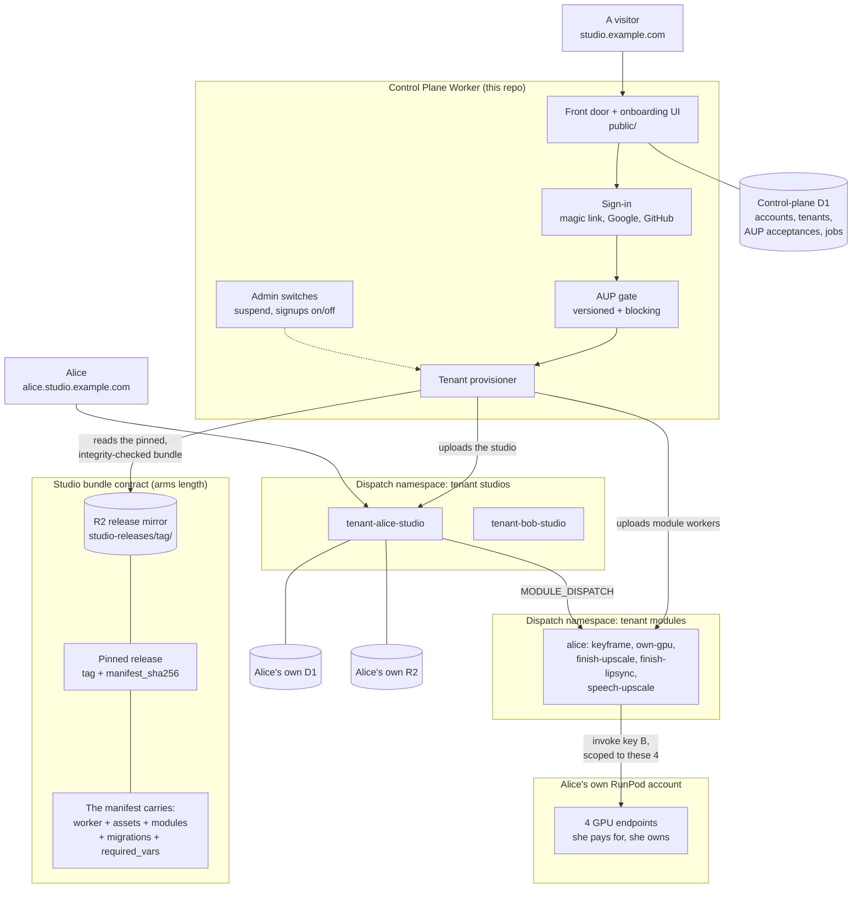

# Vivijure Control Plane

This is the **hosted door** for Vivijure Studio. It is the software that lets someone sign up,
agree to the rules, paste a key, and get their own working film studio a few minutes later,
without ever installing anything.

It is a single Cloudflare Worker. It runs separately from the studio itself, and it is released
and deployed on its own schedule.

> **Vivijure Studio is free software you run yourself.** That is the main way to use it, and it
> always will be. This repository exists so that the *other* way, where someone runs the control
> panel for you, is built in the open too.

## The one promise this repo is built around

The hosted tier sells **convenience, never capability**. There is no community edition, no
pay-gated feature, and no hosted-only trick. Hosted and self-hosted ship the same things at the
same time.

That is not a promise bolted on top of the code. It is a property of how the code works: this
control plane installs **the published studio release, unmodified**. There is no separate hosted
version of the studio that could quietly drift away from the one you can download. Anyone may run
a competing hosted Vivijure from exactly this source, and that is fine by us.

## What this control plane owns, and what it does not

It owns **accounts, sign-in, the rules gate, tenant records, provisioning, and the admin
switches**.

It owns **no film data at all**. Your projects, storyboards, cast, renders, and finished films
live in *your own* studio, on *your own* database and storage. They never pass through here and
are never stored here. That boundary is enforced by a test (`schema-guard`), not just by a
sentence in a document: the build fails if a studio table ever appears in this repo's migrations.

## The big idea: every tenant gets a whole studio

When you sign up, you do not get an account inside one shared studio. You get **your own complete
studio**: your own Worker, your own database, your own storage bucket, your own secrets.

We did it this way on purpose. The studio is built to be run by **one operator**, and that
assumption makes a lot of the code simpler and safer. If we had bolted a "which user is this?"
column onto every table instead, the hosted version would behave differently from the self-hosted
version, and the two would drift apart forever.

Instead, every tenant simply **is** the operator of their own studio. Every assumption stays
true. Nothing forks.

## How it all fits together



Read it in one line: **a visitor signs up at the front door, the provisioner builds them a studio
out of a published release artifact, and that studio talks to GPUs on the customer's own RunPod
account.**

## Signing up, step by step

This is the flow the onboarding pages in `public/` walk a person through.

1. **Sign in.** Magic link by email, or Google, or GitHub.
2. **Agree to the rules.** The Acceptable Use Policy. This blocks everything else until it is
   done, and the acceptance is recorded against a known account.
3. **Pick a name.** This becomes both your web address and the internal name of your studio.
4. **Paste key A.** A RunPod key that can create things. We use it once and **never store it**.
5. **We build your studio.** Database, storage, the studio Worker, four GPU endpoints, and five
   render modules. You can watch the progress.
6. **Mint key B in the RunPod console.** A weaker key that can only run the four endpoints we
   just made for you.
7. **Paste key B.** We check it, store it on your studio, and you are live.

## Why there are two keys

This is the heart of the security story, so it is worth being plain about it.

| | **Key A** (provisioning) | **Key B** (stored) |
|---|---|---|
| What it can do | Create things across your whole RunPod account | Run your four endpoints, and nothing else |
| How long we hold it | Used once, in memory, **never written down** | Stored as a secret on your own studio |
| If it leaked | Your whole RunPod account | Four endpoints you already own |

**Why two steps and not one?** RunPod keys can only be made by hand in their console, and a key
cannot be limited to endpoints that do not exist yet. So key B is *physically impossible* to make
until key A has already created the endpoints. The two-step flow is not us being fussy; it is the
only order that works.

**Key B is checked before it is ever stored.** If it turns out to be powerful enough to reach
RunPod's admin interface, we refuse it outright and tell you exactly why, because storing a
powerful key would throw away the whole point.

**The honest cost.** Because we never keep key A, a build that fails *on the RunPod side* cannot
restart itself. It asks you to paste key A again (`409 runpod_key_required`). Steps on the
Cloudflare side resume with no key at all. We think never holding the powerful key is worth that.

## Every feature, and every knob

### Sign-in

| Method | How it works |
|---|---|
| Magic link | Sent through postern. The sender identity is tied to our token, so we never choose a "From" address |
| Google | OIDC with PKCE, hand-rolled |
| GitHub | OAuth, hand-rolled |
| Apple | A **seam only**. It appears the day the Apple credentials are configured. No code change needed |

The front door does not hardcode a list of buttons. It asks `GET /api/platform/config` which
methods are **actually configured** (both the public id and the secret present) and renders that
list. A half-configured provider is simply absent, never a broken button.

**The one rule that matters most:** a sign-in provider can only reach an account when it says the
email address is **verified**. Without that rule, anyone who could set an unverified email
anywhere could take over the matching Vivijure account.

Sessions use `__Host-` cookies, HttpOnly and Secure. `__Host-` matters here specifically because
tenant studios are neighbouring subdomains.

### The rules gate (AUP)

Versioned, blocking, and logged, and it sits in front of provisioning from day one. No studio can
exist without a recorded acceptance by a known account.

The gate asks "has this account accepted **the current version**?", never "has this account
accepted anything?". So raising `AUP_VERSION` re-asks everyone the next time they show up, with
no migration and no backfill. A simple yes/no flag would silently wave every existing account
through changed rules, which would make the record worthless.

Acceptance records store a **hash** of the IP address, not the address itself. The record needs to
prove who agreed to what and when. It does not need to be a location database.

### Tenants

Your chosen name is both a web address label and an internal script name, so it is checked once
against the letters both of those allow, plus a reserved list so nobody can register a name that
impersonates one of our own pages.

A tenant has a **lifecycle**: `pending`, `provisioning`, `awaiting_invoke_key`, `live`, `failed`,
`deleting`, `deleted`. **Suspension is a separate flag**, not one of those values.

That separation is load-bearing and we learned it the hard way. Storing "suspended" *in* the
lifecycle column destroys the value it overwrites, so resuming has to guess where to go back to,
and guessing "live" once promoted a studio that had never actually been built. Two independent
facts need two independent columns.

### Render modules

A freshly built studio with four GPU endpoints still cannot render anything, because the endpoint
ids are read by **module workers**, and nothing creates those. So the provisioner creates them,
the same way a self-hosted studio does.

Five module workers (`keyframe`, `own-gpu`, `finish-upscale`, `finish-lipsync`, `speech-upscale`)
are uploaded into one shared dispatch namespace, named with the tenant id in front so cleanup is a
simple sweep. Each one carries only its own endpoint id. Which module maps to which endpoint is
plain **data** in the catalog, so extending the tier is a row in a table, not new code.

The studio then installs them **through its own install route**, running its own real conformance
check. No install logic is copied into the control plane.

This works even though key B does not exist yet, because the conformance check never triggers real
GPU work. Key B is added afterwards, in place, to the studio and to every module.

### Admin switches

Protected by a bearer token, compared in constant time. **If the token is unset there is no admin
surface at all**, rather than an open one. Every action is recorded, and a suspension without a
stated reason is refused, because a kill switch has to stay attributable.

- **Suspend or resume a tenant.** Pulls their routing immediately, no matter what their own studio
  thinks.
- **Turn signups on or off.** Stored in the database, not in config, so it flips **without a
  deploy**. It closes the door to *new* accounts only. It never locks out someone who already has
  an account, and by ruling it does **not** block provisioning for a person already partway
  through setup. The toggle aims at the front door, not at people already inside it.

There is no cap on the number of tenants. Storage spend is the meter that matters.

### The knobs (configuration)

Everything below is declared in `wrangler.toml.example` and mirrored by hand in the Worker's
`Env` interface. The account id is never hardcoded.

You do not edit those values into a file by hand for a real deploy. The rendered `wrangler.toml` is
built at deploy time from repository variables and secrets, so the live configuration lives in one
place instead of in somebody's working copy. See [`docs/deploy.md`](docs/deploy.md) for which name
is a variable, which is a secret, and which are allowed to be empty.

| Setting | Kind | What it is |
|---|---|---|
| `CONTROL_PLANE_HOST` | var | **The single hostname fact.** The front-door address and the tenant address suffix are both derived from it, so they cannot drift apart |
| `AUP_VERSION` | var | Current rules version. Raising it re-asks everyone |
| `AUP_URL` | var | Where the rules text is served from. **Point this at an immutable ref**, never a moving branch |
| `POSTERN_SEND_URL` | var | The email door for magic links. A URL, not a secret |
| `GOOGLE_OAUTH_CLIENT_ID` | var | Public half of Google sign-in |
| `GITHUB_OAUTH_CLIENT_ID` | var | Public half of GitHub sign-in |
| `APPLE_TEAM_ID`, `APPLE_SERVICES_ID` | var | The parked Apple seam. Empty means Apple is not offered |
| `CF_ACCOUNT_ID` | var | Needed at runtime, because a Worker cannot read its own account id |
| `DISPATCH_NAMESPACE` | var | Name of the tenant-studio namespace. Must match the binding |
| `TENANT_MODULE_NAMESPACE` | var | Name of the shared tenant-module namespace. Created if missing, but required |
| `STUDIO_RELEASE` | var | **The pinned studio release every new tenant gets.** Floor is `v1.3.1`; earlier artifacts are refused (see below) |
| `CP_DB` | D1 | Platform data only |
| `TENANT_DISPATCH` | dispatch namespace | Where tenant studios live |
| `STUDIO_RELEASES` | R2 | The release-artifact mirror |
| `CP_RATE_LIMIT` | rate limit | Throttles the outbound email path |
| `POSTERN_SEND_TOKEN` | secret | Bearer for the email door |
| `GOOGLE_OAUTH_CLIENT_SECRET` | secret | Private half of Google sign-in |
| `GITHUB_OAUTH_CLIENT_SECRET` | secret | Private half of GitHub sign-in |
| `APPLE_PRIVATE_KEY` | secret | The Apple `.p8`, parked with the rest of the seam |
| `CONTROL_PLANE_ADMIN_TOKEN` | secret | The admin gate. **Unset means no admin surface** |
| `CF_PROVISIONER_TOKEN` | secret | Mints tenant databases, storage, and scoped credentials |

**Provisioning refuses politely when it is not fully wired.** If any of `CF_PROVISIONER_TOKEN`,
`CF_ACCOUNT_ID`, `DISPATCH_NAMESPACE`, `TENANT_MODULE_NAMESPACE`, `STUDIO_RELEASE`, or the
`STUDIO_RELEASES` binding is missing, the provision routes answer `503 provisioner_unconfigured`.
Parking someone on a job that nothing will ever run is a lie with a progress bar.

## The studio bundle contract

This is the seam between the two repositories, and it is deliberately **arms length**. There is no
shared source code.

1. Vivijure Studio (`vivijure-cf`) builds a release artifact and publishes it into an R2 mirror at
   `studio-releases/<tag>/`, along with the module bundles at
   `studio-releases/<tag>/modules/<name>/`.
2. This control plane pins **one exact release**: a tag plus a `manifest_sha256`.
3. At provision time it reads that pinned bundle out of the mirror and **checks the hash** before
   using it.

The top-level studio `manifest.json` is the contract for the **studio** artifact (and the pin
`manifest_sha256` covers only that file). Module bundles are co-published under the same tag tree
at `modules/<name>/` but are **self-anchored**: each module has its own `manifest.json` with
`worker.sha256`, which this plane re-checks at provision (cf#147). A tenant may also pin modules to
a different release than the studio (cf#103), so the top-level digest deliberately does not claim
to cover module bytes.

| What ships under the tag | Where integrity is anchored |
|---|---|
| the studio **worker** | top-level `manifest.json` → `worker.sha256` (in the pin) |
| the studio **assets** | top-level manifest asset hashes (in the pin) |
| the **modules** | per-module `modules/<name>/manifest.json` → `worker.sha256` (not in the studio pin) |
| the studio **migrations** | top-level manifest (in the pin) |
| **`required_vars`** | top-level manifest (in the pin); we read that list rather than keeping our own copy |

**The pin has a floor: `v1.3.1`.** Migrations and `required_vars` only started riding the manifest
at that release, so an earlier artifact cannot describe a tenant fully enough to build one. The
control plane refuses a pre-`v1.3.1` artifact outright rather than provisioning a studio it cannot
finish. (The live plane currently pins `v1.2.0`; the bump to `v1.3.1` rides the `v1.0.0` cutover.)

That last row is the important one. If this repo kept its own idea of what a tenant studio needs,
the two lists would drift apart the first time the studio gained a setting, and the failure would
show up as a broken tenant rather than a failed build. Reading the declaration means a studio that
needs something new says so, and provisioning refuses honestly when it cannot supply it.

**A prerequisite worth stating plainly:** the mirror bucket must exist and the pinned tag's
artifact must already have been published into it before any provision can succeed. If it has not,
the provision fails honestly at the upload step rather than half-working.

## Routing

```
studio.example.com            ->  this Worker  ->  the front door (signup, account, status)
alice.studio.example.com      ->  this Worker  ->  dispatched to alice's studio
```

The front door is a Custom Domain. The tenant leg is a **wildcard route**, which needs two things
live on the zone or it does not serve at all: a proxied wildcard DNS record, and a certificate
covering the wildcard. A second-level wildcard is not covered by Universal SSL, so it needs an
Advanced Certificate Manager pack.

Tenant hostnames are always **children of the front-door hostname**. That is the ruled shape and it
holds for any self-host too.

**One warning about serving assets:** `run_worker_first = true` is load-bearing on this Worker.
Without it, static files are served straight from the edge and skip the Worker entirely, which
meant a suspended tenant's home page served the front door instead of a refusal, and a live
tenant's studio root served the front door instead of their studio. Both were found on a real
deploy. No unit test can see this, because the test suite never touches the asset layer.

## Releasing and deploying

**Each repository versions and deploys its own product.** The tags do not have to agree and are not
meant to:

- a `v*` tag **here** deploys the control plane
- a `v*` tag in `vivijure-cf` deploys the Studio panel

That split is deliberate. Before the extraction one tag did both jobs, so a Studio release and a
control-plane release could not happen independently even when they had nothing to do with each
other.

### Cutting a release

The control plane deploys from a **SemVer tag, and only from a tag**. There is no deploy-from-main
path, and no deploy-from-a-laptop path.

```bash
# bump BOTH; the pipeline refuses if they disagree
#   package.json    "version"
#   src/version.ts  CONTROL_PLANE_VERSION
git commit -am "chore(release): v1.2.3"
git tag -a v1.2.3 -m "control plane v1.2.3"
git push origin main --follow-tags
```

`.github/workflows/deploy.yml` then runs. It is **two jobs with a gate between them**, which is the
point: everything that can refuse the release happens before anything writes.

**`preflight`** (reads and checks only, writes nothing):

1. install, typecheck, tests, config-render guards
2. **tag and version must agree**, or it refuses
3. render `wrangler.toml` from `wrangler.toml.example`
4. **report pending migrations**
5. a dry run stops here

**`release`** (the writes):

6. **apply the D1 migrations**
7. **verify nothing is still pending**, and fail the deploy if it is
8. **deploy the Worker**

The config is rendered in both jobs rather than passed between them. A rendered `wrangler.toml`
contains live configuration, and handing it between jobs as an artifact would put that on the
workflow's storage for anyone with read access to the run.

### Why migrations run before the deploy, not after

Deploying first leaves a window where the new Worker code is running against the old schema, which
is exactly how this system broke before. Migrating first is safe here **because control-plane
migrations are additive**: old code tolerates a column it does not know about, whereas new code
cannot tolerate a column that is missing.

That reasoning is the whole justification, so it has a limit worth stating. **If a migration is ever
non-additive** (a drop, a rename, a narrowing), this ordering becomes wrong and the change needs a
two-tag expand-then-contract instead. Change the migration, not the ordering.

Step 6 exists because step 5 exiting cleanly only proves it did not error; it does not prove the
ledger now matches. A partial apply must never reach the deploy wearing a green checkmark.

### Schema is never applied by hand

**No hand-applied schema, ever.** Schema reaches the live database through step 5 or it does not
reach it at all.

This is not a style preference. The previous control-plane database was built by hand, so one
migration went in raw, one was skipped, one was applied after the fact, and there was no ledger to
notice any of it. Two live provisioning failures came out of that single gap. The repository's own
schema-guard test cannot catch this class, because it compares code against `migrations/` and never
against the *deployed* database. Only the deploy job can.

On a release with no schema change, steps 4 to 6 print `No migrations to apply`. That line is not
noise; it is the evidence that the ledger and `migrations/` agree.

### Dry run

Dispatch the workflow manually with `dry_run: true` (the default) to render the config and report
pending migrations, then stop. Nothing is migrated and nothing is deployed. Use it to confirm the
repository variables and secrets are populated **before** cutting a real tag, because a tag is a
public act and a failed one is awkward to take back.

### Things a deploy cannot create for itself

Typecheck will not catch any of these. Only a real deploy will.

- the **tenant dispatch namespace** must already exist, or the binding is dangling and the deploy
  fails outright
- the **studio-releases R2 bucket** must exist *and* hold the artifact for the pinned
  `STUDIO_RELEASE`, or provisioning later fails at the upload step
- the **wildcard tenant leg** needs a proxied wildcard DNS record and a certificate pack covering
  `*.<CONTROL_PLANE_HOST>`

Full mechanics, including every required variable and secret and why exactly four of them are
allowed to be empty: [`docs/deploy.md`](docs/deploy.md).

## Working on it

```bash
npm run typecheck      # the CI gate. Run it before pushing
npm test               # unit tests
npm run guard:resolve  # checks every function the pages call actually exists
npm run dev            # live, against a real local database
```

The front end here is **vanilla JavaScript, HTML, and CSS**. No framework, no build step, no CSS
preprocessor. That is deliberate. Check your JavaScript with `node --check`.

**On testing, one rule we paid for.** The in-memory store proves *decision paths only*. It encodes
our own assumptions and will happily agree with a bug in our own SQL. The real database seam is
verified against a **real D1**. Both halves are required, and the live pass is what caught the
suspension bug described above.

## The rules text

The Acceptable Use Policy, the privacy details, and the rest of the hosted legal scaffolding live
in [`docs/legal/hosted/`](docs/legal/hosted/).

**The one red line is absolute:** Vivijure is not used to create child sexual abuse material or
nonconsensual intimate imagery. Synthetic and AI-generated content is explicitly included, with no
"it is not real" exception. This is the single exception to an otherwise hands-off privacy
posture.

## Where this sits in the constellation

Vivijure is not one program. It is a small group of programs that work together.

- **[vivijure](https://github.com/skyphusion-labs/vivijure)** is the hub, and the full map lives
  there.
- **[vivijure-cf](https://github.com/skyphusion-labs/vivijure-cf)** is the Studio itself on
  Cloudflare. Self-host it and you never need this repo at all.
- **vivijure-control-plane** (this repo) is the hosted door in front of it.
- **[vivijure-backend](https://github.com/skyphusion-labs/vivijure-backend)** is the GPU render
  engine on RunPod.

## Naming

It is called the **control plane**, never the "platform". The Studio already has a `src/platform/`
that means something else entirely, and colliding with it would trap the next person to read this.

## Also in this repository

`zone-security/` holds the vivijure.com zone protections (WAF and friends) as code. Nothing there
is configured by hand in a dashboard: the script in that directory is both the record and the
mechanism. It rides with this repo because the hosted door is what those protections are actually
protecting.

## Where this came from

Extracted from [`vivijure-cf`](https://github.com/skyphusion-labs/vivijure-cf) per issue #85, so
that people running the Studio themselves are not carrying hosted-service machinery they will never
switch on. See [`NOTICE`](NOTICE) for provenance.

## Licence

AGPL-3.0-only, like everything else in the constellation. See [`LICENSE`](LICENSE).
